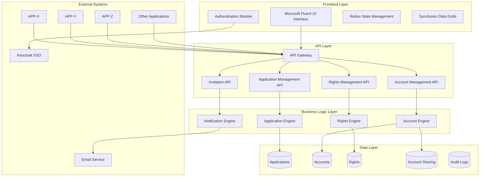
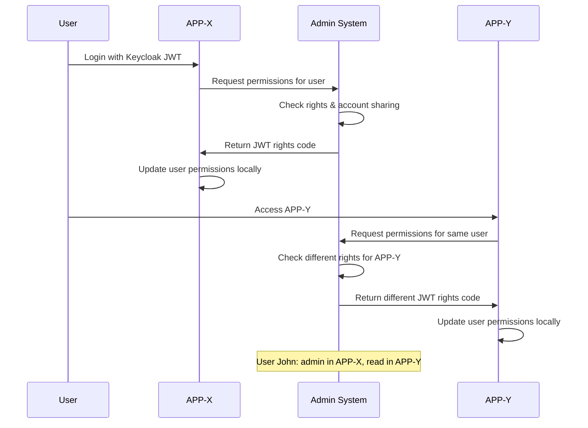

# Design Document

## Overview

The Centralized Permission Management System serves as the single source of truth for user access control across multiple applications (APP-X, APP-Y, APP-Z, etc.) in your ecosystem. This system provides a unified Microsoft-style admin dashboard where administrators can register applications, manage user permissions across all apps, handle account types and sharing relationships, and distribute JWT-based rights codes. Each registered application queries this central system to receive appropriate user permissions, ensuring consistent access control across the entire application portfolio.

## Architecture

### High-Level Architecture



### Cross-Application Permission Flow



### Technology Stack

- **Frontend**: React 18 with TypeScript
- **UI Framework**: shadcn/ui components (Microsoft-style design)
- **State Management**: Redux for application state
- **Authentication**: Keycloak integration for user JWT validation
- **Data Grid**: Syncfusion Grid for advanced data management
- **Styling**: Tailwind CSS for responsive design
- **Build Tool**: Vite
- **Testing**: Jest + React Testing Library

## Components and Interfaces

### Core Components

#### 1. Application Management Component

```typescript
interface ApplicationManagementProps {
  applications: Application[];
  onRegister: (app: ApplicationRegistration) => Promise<void>;
  onUpdate: (id: string, updates: Partial<Application>) => Promise<void>;
  onDelete: (id: string) => Promise<void>;
  statistics: ApplicationStatistics;
}

interface Application {
  id: string;
  name: string;
  applicationId: string; // Unique identifier for your applications
  description?: string;
  status: 'active' | 'inactive';
  createdAt: Date;
  updatedAt: Date;
}

interface ApplicationStatistics {
  total: number;
  active: number;
  inactive: number;
}
```

#### 2. Rights Management Component

```typescript
interface RightsManagementProps {
  rights: Rights[];
  applications: Application[];
  accounts: Account[];
  onCreateRights: (rightsRequest: RightsRequest) => Promise<void>;
  onUpdateRights: (id: string, updates: Partial<Rights>) => Promise<void>;
  onRevokeRights: (rightsId: string) => Promise<void>;
}

interface Rights {
  id: string;
  applicationId: string;
  accountId: string;
  rightsCode: string; // JWT token
  permissions: Permission[];
  expiresAt: Date;
  createdAt: Date;
  updatedAt: Date;
}

interface Permission {
  level: 'read' | 'write' | 'admin' | 'owner';
  scope: string;
  features: string[];
}
```

#### 3. Account Management Component

```typescript
interface AccountManagementProps {
  accounts: Account[];
  accountSharing: AccountSharing[];
  onCreateAccount: (account: AccountRequest) => Promise<void>;
  onUpdateAccount: (id: string, updates: Partial<Account>) => Promise<void>;
  onManageSharing: (sharing: SharingRequest) => Promise<void>;
}

interface Account {
  id: string;
  name: string;
  accountId: string;
  accountType: 'Temporary' | 'Personal' | 'Business';
  sharedAccounts: string[]; // Account IDs this account shares with
  createdAt: Date;
  updatedAt: Date;
}

interface AccountSharing {
  id: string;
  sourceAccountId: string;
  targetAccountId: string;
  status: 'pending' | 'active' | 'revoked';
  invitedBy: string;
  invitedAt: Date;
  expiresAt?: Date;
}
```

#### 4. Enhanced Dashboard Component

```typescript
interface DashboardProps {
  metrics: DashboardMetrics;
  recentActivity: ActivityItem[];
  alerts: Alert[];
  onRefresh: () => Promise<void>;
}

interface DashboardMetrics {
  applicationStats: {
    total: number;
    active: number;
    inactive: number;
  };
  rightsStats: {
    totalActive: number;
    expiringSoon: number;
  };
  accountStats: {
    personal: number;
    business: number;
    temporary: number;
  };
  pendingInvitations: number;
}
```

### Microsoft Fluent UI Integration

#### Theme Configuration

```typescript
import { createTheme, Theme } from '@fluentui/react';

export const enterpriseTheme: Theme = createTheme({
  palette: {
    themePrimary: '#0078d4',
    themeLighterAlt: '#eff6fc',
    themeLighter: '#deecf9',
    themeLight: '#c7e0f4',
    themeTertiary: '#71afe5',
    themeSecondary: '#2b88d8',
    themeDarkAlt: '#106ebe',
    themeDark: '#005a9e',
    themeDarker: '#004578',
    neutralLighterAlt: '#faf9f8',
    neutralLighter: '#f3f2f1',
    neutralLight: '#edebe9',
    neutralQuaternaryAlt: '#e1dfdd',
    neutralQuaternary: '#d0d0d0',
    neutralTertiaryAlt: '#c8c6c4',
    neutralTertiary: '#a19f9d',
    neutralSecondary: '#605e5c',
    neutralPrimaryAlt: '#3b3a39',
    neutralPrimary: '#323130',
    neutralDark: '#201f1e',
    black: '#000000',
    white: '#ffffff',
  },
  fonts: {
    small: {
      fontSize: '12px',
      fontWeight: '400',
      fontFamily: 'Segoe UI, sans-serif',
    },
    medium: {
      fontSize: '14px',
      fontWeight: '400',
      fontFamily: 'Segoe UI, sans-serif',
    },
    large: {
      fontSize: '16px',
      fontWeight: '400',
      fontFamily: 'Segoe UI, sans-serif',
    },
  },
});
```

#### Navigation Structure

```typescript
interface NavigationItem {
  key: string;
  name: string;
  icon: string;
  url: string;
  isExpanded?: boolean;
  links?: NavigationItem[];
}

export const navigationItems: NavigationItem[] = [
  {
    key: 'dashboard',
    name: 'Dashboard',
    icon: 'ViewDashboard',
    url: '/',
  },
  {
    key: 'applications',
    name: 'Applications',
    icon: 'AppIconDefault',
    url: '/applications',
  },
  {
    key: 'rights',
    name: 'Rights Management',
    icon: 'Certificate',
    url: '/rights',
  },
  {
    key: 'accounts',
    name: 'Accounts',
    icon: 'People',
    url: '/accounts',
  },
  {
    key: 'users',
    name: 'Users',
    icon: 'Contact',
    url: '/users',
  },
  {
    key: 'settings',
    name: 'Settings',
    icon: 'Settings',
    url: '/settings',
  },
];
```

## Data Models

### Database Schema

#### Applications Table

```sql
CREATE TABLE applications (
    id UUID PRIMARY KEY DEFAULT gen_random_uuid(),
    name VARCHAR(255) NOT NULL,
    application_id VARCHAR(255) UNIQUE NOT NULL,
    description TEXT,
    license_type VARCHAR(50) NOT NULL CHECK (license_type IN ('per-user', 'per-device', 'unlimited', 'feature-based')),
    max_users INTEGER,
    current_users INTEGER DEFAULT 0,
    features JSONB DEFAULT '[]',
    status VARCHAR(20) NOT NULL DEFAULT 'active' CHECK (status IN ('active', 'inactive', 'suspended')),
    expiration_date TIMESTAMP WITH TIME ZONE,
    created_at TIMESTAMP WITH TIME ZONE DEFAULT NOW(),
    updated_at TIMESTAMP WITH TIME ZONE DEFAULT NOW(),
    created_by UUID NOT NULL,
    updated_by UUID
);

CREATE INDEX idx_applications_status ON applications(status);
CREATE INDEX idx_applications_license_type ON applications(license_type);
```

#### Users Table

```sql
CREATE TABLE users (
    id UUID PRIMARY KEY DEFAULT gen_random_uuid(),
    email VARCHAR(255) UNIQUE NOT NULL,
    name VARCHAR(255) NOT NULL,
    account_type VARCHAR(20) NOT NULL CHECK (account_type IN ('Personal', 'Business', 'Enterprise')),
    status VARCHAR(20) NOT NULL DEFAULT 'active' CHECK (status IN ('active', 'inactive', 'suspended')),
    last_login TIMESTAMP WITH TIME ZONE,
    created_at TIMESTAMP WITH TIME ZONE DEFAULT NOW(),
    updated_at TIMESTAMP WITH TIME ZONE DEFAULT NOW(),
    sso_provider VARCHAR(100),
    sso_id VARCHAR(255)
);

CREATE INDEX idx_users_email ON users(email);
CREATE INDEX idx_users_account_type ON users(account_type);
CREATE INDEX idx_users_status ON users(status);
```

#### Licenses Table

```sql
CREATE TABLE licenses (
    id UUID PRIMARY KEY DEFAULT gen_random_uuid(),
    application_id UUID NOT NULL REFERENCES applications(id) ON DELETE CASCADE,
    user_id UUID NOT NULL REFERENCES users(id) ON DELETE CASCADE,
    permissions JSONB NOT NULL DEFAULT '[]',
    jwt_token TEXT NOT NULL,
    status VARCHAR(20) NOT NULL DEFAULT 'active' CHECK (status IN ('active', 'expired', 'revoked', 'suspended')),
    expiration_date TIMESTAMP WITH TIME ZONE NOT NULL,
    assigned_by UUID NOT NULL REFERENCES users(id),
    assigned_at TIMESTAMP WITH TIME ZONE DEFAULT NOW(),
    last_used TIMESTAMP WITH TIME ZONE,
    revoked_at TIMESTAMP WITH TIME ZONE,
    revoked_by UUID REFERENCES users(id),
    UNIQUE(application_id, user_id)
);

CREATE INDEX idx_licenses_user_id ON licenses(user_id);
CREATE INDEX idx_licenses_application_id ON licenses(application_id);
CREATE INDEX idx_licenses_status ON licenses(status);
CREATE INDEX idx_licenses_expiration ON licenses(expiration_date);
```

#### Account Sharing Table

```sql
CREATE TABLE account_sharing (
    id UUID PRIMARY KEY DEFAULT gen_random_uuid(),
    source_user_id UUID NOT NULL REFERENCES users(id) ON DELETE CASCADE,
    target_user_id UUID NOT NULL REFERENCES users(id) ON DELETE CASCADE,
    status VARCHAR(20) NOT NULL DEFAULT 'pending' CHECK (status IN ('pending', 'active', 'revoked')),
    invited_by UUID NOT NULL REFERENCES users(id),
    invited_at TIMESTAMP WITH TIME ZONE DEFAULT NOW(),
    accepted_at TIMESTAMP WITH TIME ZONE,
    expires_at TIMESTAMP WITH TIME ZONE,
    revoked_at TIMESTAMP WITH TIME ZONE,
    revoked_by UUID REFERENCES users(id),
    UNIQUE(source_user_id, target_user_id)
);
```

#### Invitations Table

```sql
CREATE TABLE invitations (
    id UUID PRIMARY KEY DEFAULT gen_random_uuid(),
    email VARCHAR(255) NOT NULL,
    applications JSONB NOT NULL DEFAULT '[]',
    permissions JSONB NOT NULL DEFAULT '[]',
    invitation_token VARCHAR(255) UNIQUE NOT NULL,
    status VARCHAR(20) NOT NULL DEFAULT 'pending' CHECK (status IN ('pending', 'accepted', 'expired', 'revoked')),
    invited_by UUID NOT NULL REFERENCES users(id),
    invited_at TIMESTAMP WITH TIME ZONE DEFAULT NOW(),
    expires_at TIMESTAMP WITH TIME ZONE NOT NULL,
    accepted_at TIMESTAMP WITH TIME ZONE,
    accepted_by UUID REFERENCES users(id),
    revoked_at TIMESTAMP WITH TIME ZONE,
    revoked_by UUID REFERENCES users(id)
);

CREATE INDEX idx_invitations_email ON invitations(email);
CREATE INDEX idx_invitations_status ON invitations(status);
CREATE INDEX idx_invitations_token ON invitations(invitation_token);
```

#### Audit Log Table

```sql
CREATE TABLE audit_logs (
    id UUID PRIMARY KEY DEFAULT gen_random_uuid(),
    user_id UUID REFERENCES users(id),
    action VARCHAR(100) NOT NULL,
    resource_type VARCHAR(50) NOT NULL,
    resource_id UUID,
    old_values JSONB,
    new_values JSONB,
    ip_address INET,
    user_agent TEXT,
    timestamp TIMESTAMP WITH TIME ZONE DEFAULT NOW(),
    session_id VARCHAR(255)
);

CREATE INDEX idx_audit_logs_user_id ON audit_logs(user_id);
CREATE INDEX idx_audit_logs_timestamp ON audit_logs(timestamp);
CREATE INDEX idx_audit_logs_action ON audit_logs(action);
CREATE INDEX idx_audit_logs_resource ON audit_logs(resource_type, resource_id);
```

### JWT Rights Code Structure

```typescript
interface RightsJWTPayload {
  // Standard JWT claims
  iss: string; // Issuer (centralized admin system)
  sub: string; // Subject (account ID)
  aud: string; // Audience (application ID)
  exp: number; // Expiration time
  iat: number; // Issued at
  jti: string; // JWT ID (rights ID)
  
  // Custom claims
  permissions: {
    level: 'read' | 'write' | 'admin' | 'owner';
    scope: string;
    features: string[];
  }[];
  accountType: 'Temporary' | 'Personal' | 'Business';
  sharedFrom?: string; // If rights are shared from another account
  applicationId: string; // Target application identifier
  accountId: string; // Account identifier
}
```

## Error Handling

### Error Types and Responses

```typescript
enum ErrorCode {
  // Authentication errors
  UNAUTHORIZED = 'UNAUTHORIZED',
  FORBIDDEN = 'FORBIDDEN',
  TOKEN_EXPIRED = 'TOKEN_EXPIRED',
  
  // License errors
  LICENSE_LIMIT_EXCEEDED = 'LICENSE_LIMIT_EXCEEDED',
  LICENSE_EXPIRED = 'LICENSE_EXPIRED',
  INVALID_LICENSE = 'INVALID_LICENSE',
  
  // User errors
  USER_NOT_FOUND = 'USER_NOT_FOUND',
  INVITATION_EXPIRED = 'INVITATION_EXPIRED',
  DUPLICATE_INVITATION = 'DUPLICATE_INVITATION',
  
  // Application errors
  APPLICATION_NOT_FOUND = 'APPLICATION_NOT_FOUND',
  APPLICATION_INACTIVE = 'APPLICATION_INACTIVE',
  
  // Validation errors
  VALIDATION_ERROR = 'VALIDATION_ERROR',
  INVALID_INPUT = 'INVALID_INPUT',
  
  // System errors
  INTERNAL_ERROR = 'INTERNAL_ERROR',
  SERVICE_UNAVAILABLE = 'SERVICE_UNAVAILABLE',
}

interface ErrorResponse {
  code: ErrorCode;
  message: string;
  details?: Record<string, any>;
  timestamp: string;
  requestId: string;
}
```

### Error Handling Strategy

1. **Client-Side Error Handling**
   - Global error boundary for React components
   - Toast notifications for user-facing errors
   - Retry mechanisms for transient failures
   - Graceful degradation for non-critical features

2. **API Error Handling**
   - Standardized error response format
   - Proper HTTP status codes
   - Detailed error logging
   - Rate limiting and circuit breaker patterns

3. **Authentication Error Handling**
   - Automatic token refresh
   - Redirect to login on authentication failure
   - Session timeout warnings
   - SSO integration error handling

## Testing Strategy

### Unit Testing

```typescript
// Example test for license assignment
describe('LicenseService', () => {
  describe('assignLicense', () => {
    it('should assign license successfully', async () => {
      const mockUser = createMockUser();
      const mockApplication = createMockApplication();
      const mockLicense = createMockLicense();
      
      jest.spyOn(userService, 'findById').mockResolvedValue(mockUser);
      jest.spyOn(applicationService, 'findById').mockResolvedValue(mockApplication);
      jest.spyOn(licenseRepository, 'create').mockResolvedValue(mockLicense);
      
      const result = await licenseService.assignLicense({
        userId: mockUser.id,
        applicationId: mockApplication.id,
        permissions: [{ level: 'read', scope: 'basic', features: [] }],
        expirationDate: new Date('2024-12-31'),
      });
      
      expect(result).toEqual(mockLicense);
      expect(licenseRepository.create).toHaveBeenCalledWith(
        expect.objectContaining({
          userId: mockUser.id,
          applicationId: mockApplication.id,
        })
      );
    });
    
    it('should throw error when license limit exceeded', async () => {
      const mockUser = createMockUser();
      const mockApplication = createMockApplication({ maxUsers: 1, currentUsers: 1 });
      
      jest.spyOn(userService, 'findById').mockResolvedValue(mockUser);
      jest.spyOn(applicationService, 'findById').mockResolvedValue(mockApplication);
      
      await expect(
        licenseService.assignLicense({
          userId: mockUser.id,
          applicationId: mockApplication.id,
          permissions: [{ level: 'read', scope: 'basic', features: [] }],
          expirationDate: new Date('2024-12-31'),
        })
      ).rejects.toThrow('LICENSE_LIMIT_EXCEEDED');
    });
  });
});
```

### Integration Testing

```typescript
// Example integration test for license management API
describe('License Management API', () => {
  beforeEach(async () => {
    await setupTestDatabase();
    await seedTestData();
  });
  
  afterEach(async () => {
    await cleanupTestDatabase();
  });
  
  it('should handle complete license assignment flow', async () => {
    const user = await createTestUser();
    const application = await createTestApplication();
    
    // Test license assignment
    const assignResponse = await request(app)
      .post('/api/licenses/assign')
      .set('Authorization', `Bearer ${getTestToken()}`)
      .send({
        userId: user.id,
        applicationId: application.id,
        permissions: [{ level: 'read', scope: 'basic', features: [] }],
        expirationDate: '2024-12-31T23:59:59Z',
      })
      .expect(201);
    
    expect(assignResponse.body).toHaveProperty('id');
    expect(assignResponse.body.status).toBe('active');
    
    // Test license retrieval
    const getResponse = await request(app)
      .get(`/api/licenses/${assignResponse.body.id}`)
      .set('Authorization', `Bearer ${getTestToken()}`)
      .expect(200);
    
    expect(getResponse.body.id).toBe(assignResponse.body.id);
    
    // Test license revocation
    await request(app)
      .delete(`/api/licenses/${assignResponse.body.id}`)
      .set('Authorization', `Bearer ${getTestToken()}`)
      .expect(204);
    
    // Verify license is revoked
    const verifyResponse = await request(app)
      .get(`/api/licenses/${assignResponse.body.id}`)
      .set('Authorization', `Bearer ${getTestToken()}`)
      .expect(200);
    
    expect(verifyResponse.body.status).toBe('revoked');
  });
});
```

### End-to-End Testing

```typescript
// Example E2E test using Playwright
import { test, expect } from '@playwright/test';

test.describe('License Management Workflow', () => {
  test('admin can assign and manage licenses', async ({ page }) => {
    // Login as admin
    await page.goto('/login');
    await page.fill('[data-testid="email"]', 'admin@company.com');
    await page.fill('[data-testid="password"]', 'password123');
    await page.click('[data-testid="login-button"]');
    
    // Navigate to license management
    await page.click('[data-testid="nav-licenses"]');
    await expect(page).toHaveURL('/licenses');
    
    // Assign new license
    await page.click('[data-testid="assign-license-button"]');
    await page.selectOption('[data-testid="user-select"]', 'user@company.com');
    await page.selectOption('[data-testid="application-select"]', 'app-1');
    await page.check('[data-testid="permission-read"]');
    await page.fill('[data-testid="expiration-date"]', '2024-12-31');
    await page.click('[data-testid="assign-button"]');
    
    // Verify license appears in list
    await expect(page.locator('[data-testid="license-list"]')).toContainText('user@company.com');
    await expect(page.locator('[data-testid="license-list"]')).toContainText('Active');
    
    // Test bulk operations
    await page.click('[data-testid="bulk-operations"]');
    await page.setInputFiles('[data-testid="csv-upload"]', 'test-licenses.csv');
    await page.click('[data-testid="upload-button"]');
    
    // Verify bulk upload success
    await expect(page.locator('[data-testid="success-message"]')).toBeVisible();
  });
});
```

## Cross-Application Integration API

### Permission Request Endpoint

```typescript
// POST /api/permissions/request
interface PermissionRequest {
  applicationId: string;
  userToken: string; // Keycloak JWT
}

interface PermissionResponse {
  success: boolean;
  rightsCode?: string; // JWT rights code
  permissions?: Permission[];
  accountType?: 'Temporary' | 'Personal' | 'Business';
  expiresAt?: Date;
  error?: string;
}
```

### Application Registration Endpoint

```typescript
// POST /api/applications/register
interface ApplicationRegistration {
  name: string;
  applicationId: string; // Unique identifier (APP-X, APP-Y, etc.)
  description?: string;
  callbackUrl?: string; // For permission updates
}
```

### Bulk Permission Check

```typescript
// POST /api/permissions/bulk-check
interface BulkPermissionRequest {
  applicationId: string;
  userTokens: string[]; // Multiple Keycloak JWTs
}

interface BulkPermissionResponse {
  results: {
    [userToken: string]: PermissionResponse;
  };
}
```

## Example Integration

### APP-X Integration Example

```typescript
// In APP-X application
class PermissionService {
  async getUserPermissions(userToken: string): Promise<UserPermissions> {
    const response = await fetch('/api/permissions/request', {
      method: 'POST',
      headers: { 'Content-Type': 'application/json' },
      body: JSON.stringify({
        applicationId: 'APP-X',
        userToken: userToken
      })
    });
    
    const result = await response.json();
    
    if (result.success) {
      // Update local user permissions
      this.updateLocalPermissions(result.permissions);
      return result.permissions;
    }
    
    throw new Error(result.error);
  }
}
```

This comprehensive design document provides the foundation for implementing a centralized permission management system that controls user access across multiple applications with modern architecture, robust security, and professional Microsoft-style user experience.